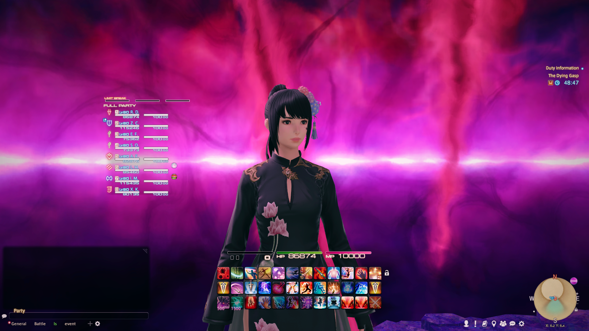
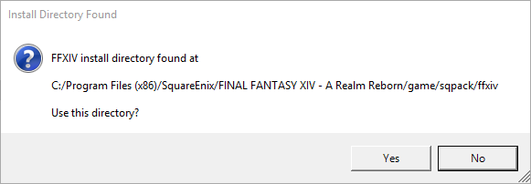
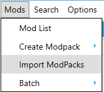
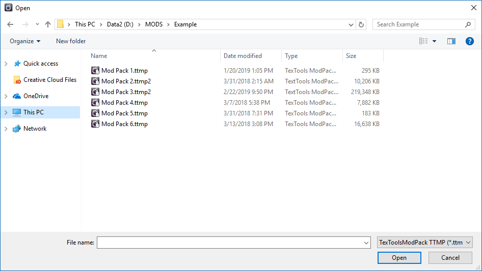
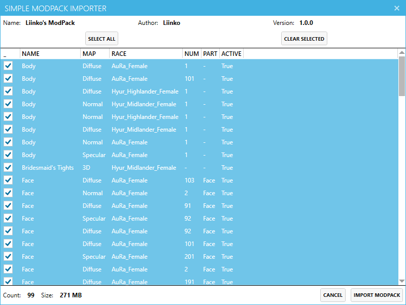
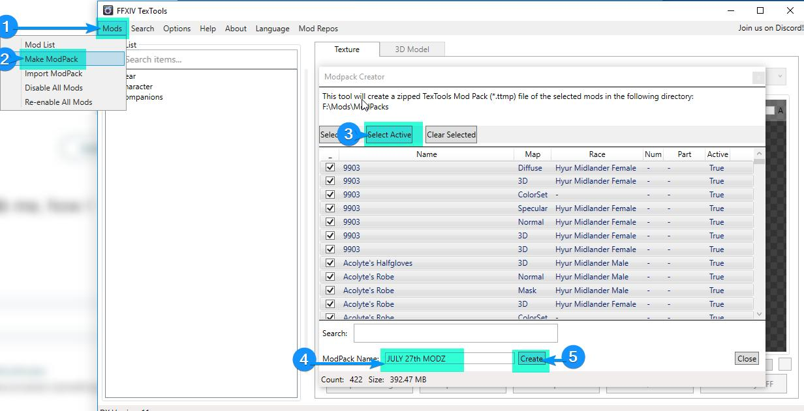

# Minimal UI

Minimal UI is a mod for FFXIV that reworks a large portion of the user interface with the goal of simplicity and ease of use in a raid scenario.

## Circle Status Icons

Circle Status Icons is a mod for FFXIV that changes (most) DoW/DoM beneficial status effects into circles.

## Preview

## Installing the mod

**TEXTOOLS VERSION 2.0.6 OR HIGHER IS REQUIRED.**

Visit https://textools.dualwield.net/ and download the application installer.

When first opening TexTools, the application will try to detect your FFXIV installation. Confirm that the destination is correct and TexTools will open after.

To import the minimal UI packages, go to the mods menu and select “import modpack”. Select the .TTMP2 files that were included in the mod download.

A new window will pop letting you choose which elements you would like to import. For now, you can just hit import. Once it finishes importing, the mod should be successfully installed.

## Disabling specific elements
If you don’t like certain parts of the mod, you can disable them during or after importing. Refer to the [texture list](/texturelist) for more information on what each texture corresponds to.

## What to do for new FFXIV patches

I recommend making a mod backup, you can do this by selecting “Make Modpack” in the mods menu, selecting every active mod, and hitting create.

Before downloading a new FFXIV patch it is safest to hit the "Start Over" option in the TexTools help menu, installing the FFXIV patch, then importing the mod backup you created previously.

While these precautions don’t always turn out to be necessary, you risk damaging your install if you don’t take them.

## Making changes to textures
If you would like to further customize the included textures to your liking, you are welcome to do so. The TexTools website has easy to follow [tutorials](https://textools.dualwield.net/tutorials/) on basic texture editing. Refer to the [texture list](/texturelist) to locate elements you’re interested in changing.

## Troubleshooting

TexTools will automatically create backups of the game’s files. If you are getting any crashes or texture issues after a patch, you can revert your game files back to default by using the “Start Over” option in the TexTools help menu.

If you are still having issues with mods, visit the [TexTools discord](https://discord.gg/ssupHwX) for dedicated help channels, 
or read [Sel's troubleshooting guide](https://docs.google.com/document/d/1uZ7XfhzFH-Aw9xjN55WGF7-rGoH-vRiAocRnXwE_uUo/). These two resources should address 99% of the issues you may encounter.

## Disclaimers
This mod (and TexTools as a whole), much like Advanced Combat Tracker, are against the Final Fantasy XIV User License Agreement and Terms of Service. 

However, they are undetectable by Square-Enix, as long as you don't discuss them in-game. 

Modding isn’t an exact science and new patches can cause issues with your game in unexpected ways. 

**You are taking full responsibility for any consequences that occur from using any mods.**

This mod doesn't aim to update everything in the game at this point. Things not edited include, but aren't limited to:

* Anything gold saucer related
* Anything pvp related
* Many menus and related icons relating to obscure/one-time events (valentiones, hall of the novice, etc.)
* Many icons for subsystems rarely seen by most players (submarine expeditions, leves, etc.)

## FAQ
**Have the default gauges been modified?**

Being a minimal-styled mod, minimal ui was designed with simplified gauges in mind. No default gauges have been touched.

**Can you change the color of the HP/MP/Gauge bars?**

Not currently, outside of slight brightness/saturation changes. The game engine recolors these on it’s own.

**Does this mod support the light theme?**

Not at this time.

## Credit / Support 
This mod was created by Rien Doll of Jenova, with various contributions from anonymous users and members of the TexTools discord.

Thank you to all testers!

If you would like to donate for my work, you may do so [here](https://ko-fi.com/rien_doll). Donations are entirely optional, but appreciated!

Please direct message me on [twitter](https://twitter.com/rien_doll) if you have any questions that the troubleshooting section or FAQ don’t answer. I will also post updates and news there.

The font used in most textures is [SCE-Ps3 Rodin LATIN](https://fontsup.com/font/sce-ps3-rodin-latin-bold.html).
