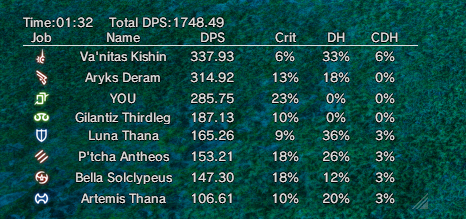

# Overlayplugin theme

# Instructions

* Download and install Overlayplugin for Advanced Combat Tracker [here](https://github.com/hibiyasleep/OverlayPlugin/releases).

* Extract the contents of this folder to your OverlayPlugin folder (if you don't have one, create one).

* In your OverlayPlugin settings, set the Mini Parse URL to the "minimalui.html" file included in this folder.

* **Optional**: Install the recommended font file [here](https://fontsup.com/font/sce-ps3-rodin-latin-bold.html)

# Disclaimers

* This is nowhere near as functional as themes like Mopimopi or Kagerou; it's designed to be as simple as possible while matching the minimal UI mod.
* There are some issues like job icons flashing after downtime that I do not know how to fix (sorry).

# Credit

Everything here belongs entirely to RainbowMage - my theme was built off theirs.
